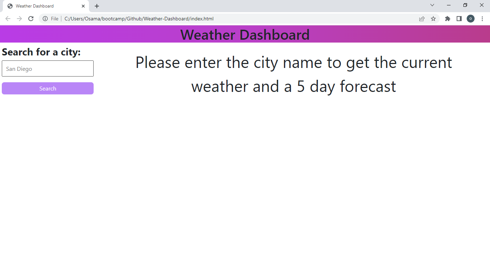
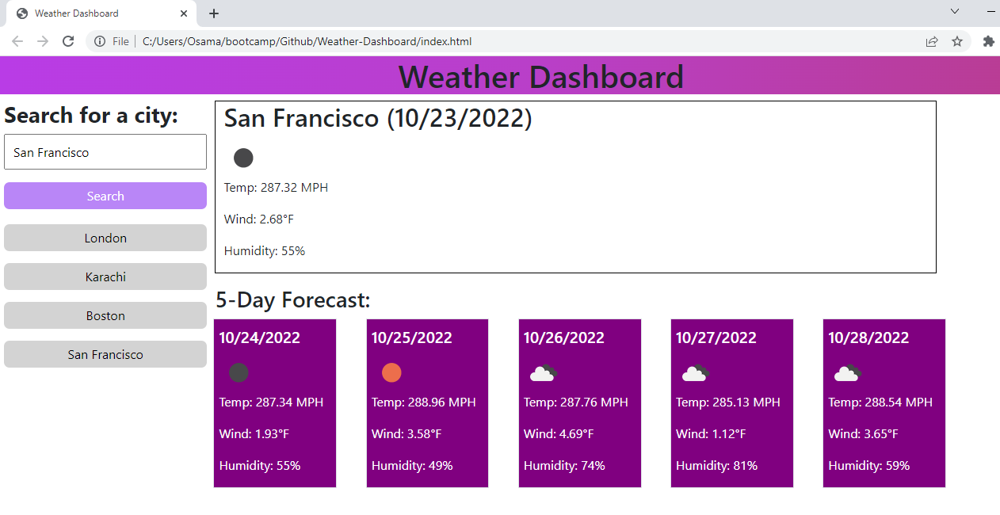

# Weather-Dashboard

## Descriptions 
This Weather dashboard app shows the current weather for any city and a forecast for 5 days.

## URL
https://oriarh.github.io/Weather-Dashboard/

## Screenshot

## Installation
N/A

## Usage
When the user opens the above provided URL, they are presented with a clean and simple interface for a weather app.

The user can type any city's name and they will be presented with it's current weather and a 5 day forecast along with the dates.

The city they searched for get saved in localStorage and are available the next time they reload the app.

They can also click those saved buttons to retrieve the weather for that city.

This web app was built using HTML and CSS, Bootstrap & JQuery.

## Credits
UC Berkeley Extension Instructional Staff/
Bootstrap CDN

## License
MIT License
